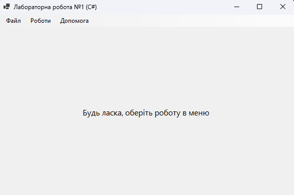
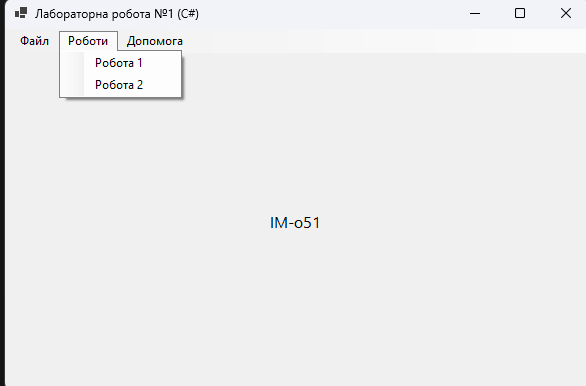
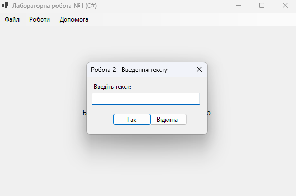
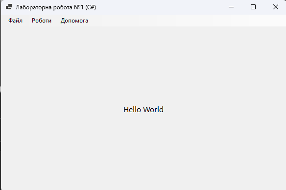

<div style="text-align: center; font-size: 24px; margin-top: 60px;">

Міністерство освіти і науки України

Національний технічний університет України
«Київський політехнічний інститут імені Ігоря Сікорського»

Факультет інформатики та обчислювальної техніки
Кафедра обчислювальної техніки

</div>

<div style="text-align: center; margin-top: 120px;">

<h1 style="font-size: 22px;">Лабораторна робота №1</h1>

<h2 style="font-size: 22px;">з дисципліни «Об'єктно-орієнтоване програмування»</h2>

<h3 style="font-size: 22px; margin-top: 20px;">на тему</h3>

<h2 style="font-size: 22px;">«Знайомство із середовищем розробки програм Microsoft Visual Studio та складання модульних проєктів програм на C#»</h2>

</div>

<div style="text-align: right; margin-top: 120px; font-size: 18px;">

<strong>Виконав:</strong><br>
Мащута Олександр<br>
студент групи IM-051<br>
номер у списку групи: 7<br><br>

<strong>Перевірив:</strong><br>
Рекечинський Дмитро Олександрович

</div>

<div style="text-align: center; margin-top: 120px; font-size: 20px;">

Київ 2026

</div>

---

## Завдання

1. Створити у середовищі MS Visual Studio проєкт WinForms з ім’ям Lab1.
2. Написати вихідний текст програми згідно варіанту завдання.
3. Скомпілювати вихідний текст і отримати виконуваний файл програми.
4. Перевірити роботу програми. Налагодити програму.
5. Проаналізувати та прокоментувати результати та вихідний текст програми.
6. Оформити звіт.

---

## Завдання згідно варіанту

Для студента №7 (Ж = 7) визначено наступні варіанти:

1. **Робота 1 (В1 = Ж mod 4 = 3)**:
   Вікно діалогу з елементом списку (List Box) та двома кнопками: [Так] і [Відміна]. У список автоматично записуються назви груп факультету. Після вибору потрібного рядка списку і натискання [Так], у головному вікні має відображатися текст вибраного рядка списку.

2. **Робота 2 (В2 = (Ж+1) mod 4 = 0)**:
   Вікно діалогу для вводу тексту, яке має стрічку вводу (TextBox) та дві кнопки: [Так] і [Відміна]. Якщо ввести рядок тексту і натиснути [Так], то у головному вікні повинен відображатися введений текст.

---

## Вихідний текст програми

### Головний файл MainWindow.cs (фрагменти)

У головному вікні реалізовано обробку натискань пунктів меню та вивід результату за допомогою `Label`, що розташований по центру форми.

```csharp
// Обробка виклику Роботи 1
private void OnWork1Clicked(object sender, EventArgs e)
{
    using (var form = new Module1Form())
    {
        if (form.ShowDialog() == DialogResult.OK)
        {
            lblDisplayText.Text = form.Result;
        }
    }
}

// Обробка виклику Роботи 2
private void OnWork2Clicked(object sender, EventArgs e)
{
    using (var form = new Module2Form())
    {
        if (form.ShowDialog() == DialogResult.OK)
        {
            lblDisplayText.Text = form.Result;
        }
    }
}
```

### Модуль 1 (Module1Form.cs)

Модуль реалізує модальне вікно з `ListBox`, який ініціалізується списком груп при створенні форми.

```csharp
public class Module1Form : Form
{
    private ListBox lbGroups;
    public string Result { get; private set; } = "";

    public Module1Form()
    {
        // ... ініціалізація елементів ...
        string[] groups = { "IM-051", "IM-052", "IM-053", "IM-054", "IM-055", "IM-056" };
        foreach (var group in groups) lbGroups.Items.Add(group);
        
        btnOk.Click += (s, e) =>
        {
            if (lbGroups.SelectedItem != null)
            {
                Result = lbGroups.SelectedItem.ToString();
                this.Close();
            }
        };
    }
}
```

### Модуль 2 (Module2Form.cs)

Модуль реалізує модальне вікно з `TextBox` для вільного введення тексту користувачем.

```csharp
public class Module2Form : Form
{
    private TextBox txtInput;
    public string Result { get; private set; } = "";

    public Module2Form()
    {
        // ... ініціалізація елементів ...
        btnOk.Click += (s, e) =>
        {
            Result = txtInput.Text;
            this.Close();
        };
    }
}
```

---

## Діаграми

### Структура проєкту та залежності

Оскільки проєкт реалізовано на C# WinForms, структура є більш спрощеною завдяки автоматичному управлінню ресурсами та використанням .NET SDK.

```
Lab1 (Project)
├── Program.cs (Entry Point)
├── MainWindow.cs (Main UI)
├── Module1Form.cs (Dialog 1)
└── Module2Form.cs (Dialog 2)
```

---

## Скріншоти

### Головне вікно програми

_Рис. 1. Головне вікно програми з меню «Роботи» та «Допомога»_

---

### Вікно діалогу «Робота 1»

_Рис. 2. Вікно діалогу модуля 1 — вибір групи з ListBox_

---

### Результат роботи «Робота 1»

_Рис. 3. Виведення обраної групи у головному вікні_

---

### Вікно діалогу «Робота 2»

_Рис. 4. Вікно діалогу модуля 2 — введення тексту через TextBox_

---

### Результат роботи «Робота 2»

_Рис. 5. Виведення введеного тексту у головному вікні_

---

## Висновки

У цій лабораторній роботі я реалізував модульний проєкт на мові програмування C# з використанням технології Windows Forms. 

Завдяки використанню C#, процес розробки графічного інтерфейсу був значно прискорений порівняно з Win32 API. Я навчився створювати головне вікно програми, організовувати навігацію через меню та взаємодіяти з користувачем за допомогою модальних вікон.

Було реалізовано два різних типи взаємодії: вибір даних зі списку (`ListBox`) та вільне введення тексту (`TextBox`). Всі діалогові вікна були реалізовані як окремі класи, що забезпечило чітку модульність та розділення відповідальності в програмі.

Ця робота дозволила мені закріпити базові принципи ООП, такі як інкапсуляція даних у класах форм та використання властивостей для передачі результатів між вікнами.
