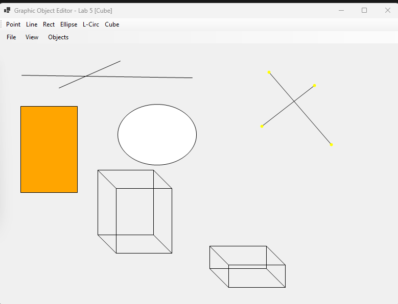
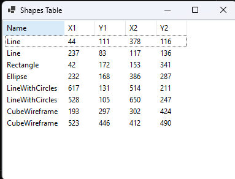

<div style="text-align: center; font-size: 24px; margin-top: 60px;">

Міністерство освіти і науки України

Національний технічний університет України
«Київський політехнічний інститут імені Ігоря Сікорського»

Факультет інформатики та обчислювальної техніки
Кафедра обчислювальної техніки

</div>

<div style="text-align: center; margin-top: 120px;">

<h1 style="font-size: 22px;">Лабораторна робота №5</h1>

<h2 style="font-size: 22px;">з дисципліни «Об'єктно-орієнтоване програмування»</h2>

<h3 style="font-size: 22px; margin-top: 20px;">на тему</h3>

<h2 style="font-size: 22px;">«Багатовіконний інтерфейс, Singleton та збереження даних»</h2>

</div>

<div style="text-align: right; margin-top: 120px; font-size: 18px;">

<strong>Виконав:</strong><br>
Мащута Олександр<br>
студент групи IM-051<br>
номер у списку групи: 7<br><br>

<strong>Перевірив:</strong><br>
Рекечинський Дмитро Олександрович

</div>

<div style="text-align: center; margin-top: 120px; font-size: 20px;">

Київ 2026

</div>

---

## Завдання

1. Перетворити клас `MyEditor` на патерн **Singleton Меєрса** (потокобезпечна лінива ініціалізація).
2. Створити немодальне вікно таблиці `MyTableForm` як незалежний модуль.
3. Забезпечити автоматичне оновлення таблиці при створенні/завантаженні об'єктів.
4. Реалізувати збереження списку створених об'єктів у текстовий файл та їх завантаження з файлу.
5. Налагодити багатовіконну взаємодію у графічному середовищі C# WinForms.
6. Оформити звіт.

---

## Завдання згідно варіанту

Для студента №7 (Ж = 7):
1. **Патерн Singleton Меєрса**: Реалізований через `Lazy<MyEditor>` у режимі `ExecutionAndPublication` (C#-еквівалент `static MyEditor instance` у C++), що забезпечує гарантовану єдиність екземпляра та потокобезпеку.
2. **Немодальне вікно таблиці (`MyTableForm`)**: Містить `ListView` з колонками `Name`, `X1`, `Y1`, `X2`, `Y2`. Форма приймає прості кортежі даних і не має жорсткої залежності від типів `Shape` чи `MyEditor`.
3. **Робота з файлами**: Формат збереження — TSV (Tab-Separated Values). Завантаження відновлює об'єкти за іменем класу через фабричний метод `CreateShapeByName`.

---

## Вихідний текст програми

### Клас Singleton MyEditor.cs

```csharp
using System;
using System.Collections.Generic;
using System.Drawing;
using System.IO;
using Lab5.Shapes;

namespace Lab5
{
    public class MyEditor
    {
        private static readonly Lazy<MyEditor> _lazy =
            new Lazy<MyEditor>(() => new MyEditor());

        public static MyEditor Instance => _lazy.Value;

        private readonly object _sync = new object();
        private readonly List<Shape> _shapes = new List<Shape>();

        private MyEditor() { }

        public void AddShape(Shape shape)
        {
            lock (_sync)
            {
                _shapes.Add(shape);
            }
        }

        public IReadOnlyList<Shape> GetShapes() => _shapes.AsReadOnly();

        public void DrawAll(Graphics g, Pen pen)
        {
            List<Shape> snapshot;
            lock (_sync)
            {
                snapshot = new List<Shape>(_shapes);
            }

            foreach (var shape in snapshot)
            {
                shape.Draw(g, pen, GetFillBrush(shape));
            }
        }

        private static Brush GetFillBrush(Shape shape) => shape switch
        {
            RectShape => Brushes.Orange,
            EllipseShape => Brushes.White,
            LineWithCirclesShape => Brushes.Yellow,
            CubeWireframeShape => Brushes.Cyan,
            _ => Brushes.LightGray
        };

        public void SaveToFile(string path)
        {
            using (StreamWriter sw = new StreamWriter(path))
            {
                foreach (var s in GetShapes())
                {
                    sw.WriteLine($"{s.GetName()}\t{s.X1}\t{s.Y1}\t{s.X2}\t{s.Y2}");
                }
            }
        }

        public int LoadFromFile(string path)
        {
            var loaded = new List<Shape>();
            foreach (var line in File.ReadAllLines(path))
            {
                string[] p = line.Split('\t');
                if (p.Length < 5) continue;
                if (!int.TryParse(p[1], out int x1) || !int.TryParse(p[2], out int y1) ||
                    !int.TryParse(p[3], out int x2) || !int.TryParse(p[4], out int y2)) continue;

                Shape? shape = CreateShapeByName(p[0], x1, y1, x2, y2);
                if (shape != null) loaded.Add(shape);
            }

            lock (_sync)
            {
                _shapes.Clear();
                _shapes.AddRange(loaded);
            }
            return loaded.Count;
        }

        private static Shape? CreateShapeByName(string name, int x1, int y1, int x2, int y2) => name switch
        {
            "Point" => new PointShape(x1, y1, x2, y2),
            "Line" => new LineShape(x1, y1, x2, y2),
            "Rectangle" => new RectShape(x1, y1, x2, y2),
            "Ellipse" => new EllipseShape(x1, y1, x2, y2),
            "LineWithCircles" => new LineWithCirclesShape(x1, y1, x2, y2),
            "CubeWireframe" => new CubeWireframeShape(x1, y1, x2, y2),
            _ => null
        };
    }
}
```

### Модуль вікна таблиці MyTableForm.cs

```csharp
using System;
using System.Collections.Generic;
using System.Drawing;
using System.Windows.Forms;

namespace Lab5
{
    public class MyTableForm : Form
    {
        private ListView _listView;

        public MyTableForm()
        {
            this.Text = "Shapes Table";
            this.Size = new Size(400, 300);
            this.StartPosition = FormStartPosition.CenterScreen;

            _listView = new ListView
            {
                View = View.Details,
                Dock = DockStyle.Fill,
                FullRowSelect = true
            };

            _listView.Columns.Add("Name", 100);
            _listView.Columns.Add("X1", 50);
            _listView.Columns.Add("Y1", 50);
            _listView.Columns.Add("X2", 50);
            _listView.Columns.Add("Y2", 50);

            this.Controls.Add(_listView);
        }

        public void UpdateData(IEnumerable<(string Name, int X1, int Y1, int X2, int Y2)> rows)
        {
            _listView.BeginUpdate();
            _listView.Items.Clear();
            foreach (var (name, x1, y1, x2, y2) in rows)
            {
                var item = new ListViewItem(name);
                item.SubItems.Add(x1.ToString());
                item.SubItems.Add(y1.ToString());
                item.SubItems.Add(x2.ToString());
                item.SubItems.Add(y2.ToString());
                _listView.Items.Add(item);
            }
            _listView.EndUpdate();
        }
    }
}
```

---

## Діаграми

### Діаграма залежностей модулів

```
MainWindow (Main UI Form)
├── MyEditor (Singleton Instance)
│   └── List<Shape>
└── MyTableForm (Modeless Table Window)
    └── ListView (Independent UI Component)
```

### Діаграма класів (UML) з Singleton

```
┌──────────────────────────────────────────────┐
│             MyEditor (Singleton)             │
├──────────────────────────────────────────────┤
│ - _lazy : static Lazy<MyEditor>              │
│ - _shapes : List<Shape>                      │
├──────────────────────────────────────────────┤
│ + Instance : static MyEditor                 │
│ + AddShape(shape: Shape)                     │
│ + GetShapes() : IReadOnlyList<Shape>         │
│ + SaveToFile(path: string)                   │
│ + LoadFromFile(path: string) : int           │
└──────────────────────┬───────────────────────┘
                       │ uses
┌──────────────────────▼───────────────────────┐
│                 MyTableForm                  │
├──────────────────────────────────────────────┤
│ - _listView : ListView                       │
├──────────────────────────────────────────────┤
│ + UpdateData(rows: IEnumerable<Tuple>)       │
└──────────────────────────────────────────────┘
```

---

## Скріншоти

### Головне вікно та немодальне вікно таблиці

_Рис. 1. Одночасна робота головного вікна редактора та немодальної таблиці об'єктів_

---

### Збереження об'єктів у файл

_Рис. 2. Діалог збереження координат створених об'єктів у текстовий файл_

---

### Автоматичне оновлення даних у таблиці

_Рис. 3. Автоматична поява нових рядків у таблиці при додаванні фігур_

---

## Висновки

У цій лабораторній роботі реалізовано багатовіконний інтерфейс користувача з підтримкою збереження стану програми у файл.

Клас `MyEditor` рефакторено в потокобезпечний **Singleton Меєрса** через `Lazy<T>`, що виключило дублювання стану редактора. Створено незалежний немодальний модуль `MyTableForm`, який забезпечує перегляд характеристик усіх створених об'єктів та синхронно оновлює свої дані при малюванні або завантаженні об'єктів з текстового файлу.
